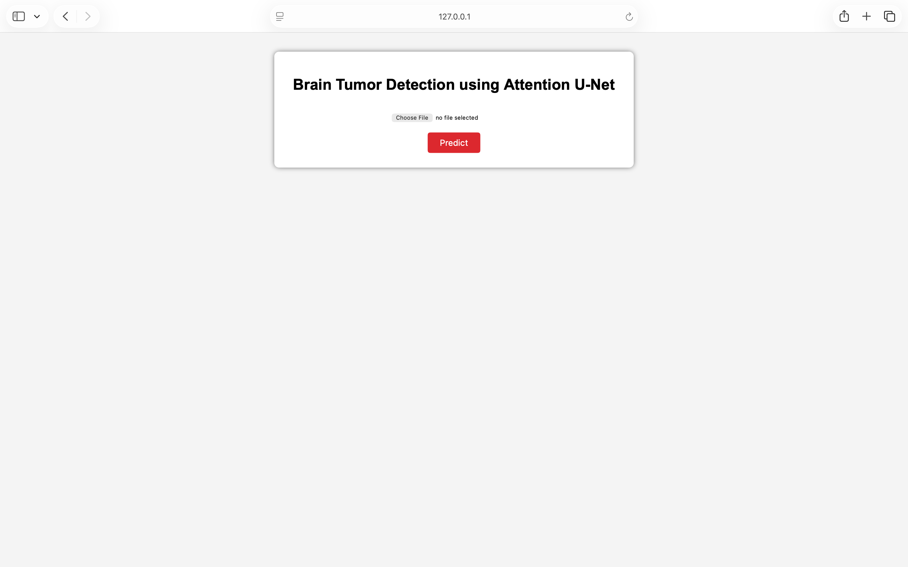
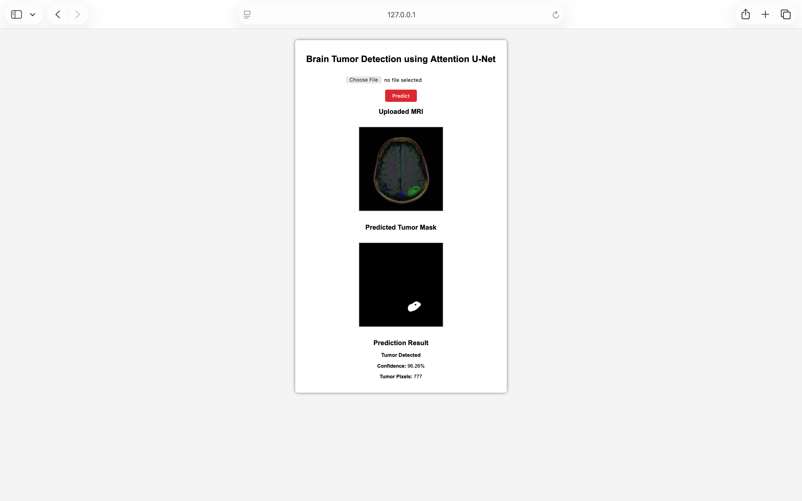

# 🧠 Brain Tumor Detection using Attention U-Net

A deep learning web application for **Brain Tumor Detection and Segmentation** from MRI images using the **Attention U-Net** architecture.

The application allows users to upload an MRI scan, predicts the tumor region, generates a segmentation mask, and displays the prediction confidence and tumor pixel count.

---

## 📌 Features

- Upload Brain MRI Images
- Automatic Tumor Segmentation
- Tumor Detection Result
- Confidence Score
- Tumor Pixel Count
- User-friendly Flask Web Application
- Attention U-Net Deep Learning Model

---

## 🖼️ Application Screenshots

### Home Page



---

### Prediction Result



---

## 🛠️ Technologies Used

- Python
- TensorFlow
- Keras
- Flask
- OpenCV
- NumPy
- HTML
- CSS

---

## 🧠 Model Architecture

- Attention U-Net
- Input Image Size: **256 × 256 × 3**
- Output: Binary Tumor Segmentation Mask
- Optimizer: Adam
- Loss Function: Binary Crossentropy + Dice Loss

---

## 📂 Project Structure

```text
BrainTumorDetection/
│
├── app.py
├── train.py
├── evaluate.py
├── predict.py
├── plot_training.py
├── README.md
├── requirements.txt
├── .gitignore
│
├── models/
│   ├── attention_unet.py
│   ├── losses.py
│   └── metrics.py
│
├── utils/
│   ├── dataloader.py
│   └── preprocessing.py
│
├── templates/
│   └── index.html
│
├── static/
│
└── saved_models/
    └── best_attention_unet.keras
```

---

## 🚀 Installation

Clone the repository

```bash
git clone https://github.com/ibraheem74/BrainTumorDetection.git
```

Go to the project folder

```bash
cd BrainTumorDetection
```

Install dependencies

```bash
pip install -r requirements.txt
```

---

## ▶️ Run the Application

Start the Flask server

```bash
python app.py
```

Open your browser

```
http://127.0.0.1:5000
```

Upload a Brain MRI image and click **Predict** to generate the tumor segmentation mask.

---

## 📊 Output

The application displays:

- Uploaded MRI Image
- Predicted Tumor Mask
- Tumor Detection Result
- Confidence Score
- Tumor Pixel Count

---

## 🔮 Future Improvements

- Support multiple MRI image formats
- Improve segmentation accuracy with larger datasets
- Deploy the application on a cloud platform
- Add Grad-CAM visualization for explainability

---

## 👨‍💻 Author

**Ibraheem**

B.Tech Computer Science Engineering

Dr. M.G.R. Educational and Research Institute

GitHub: https://github.com/ibraheem74

---

## 📄 License

This project is developed for educational and academic purposes.